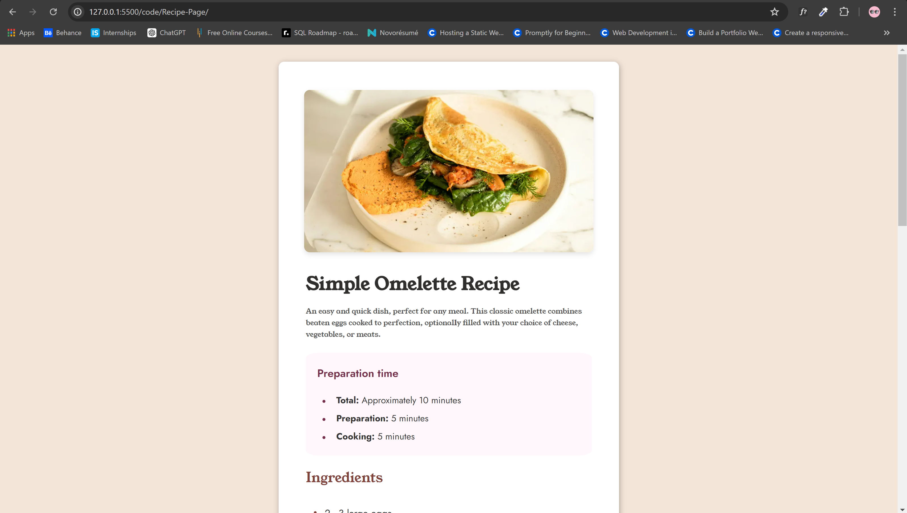
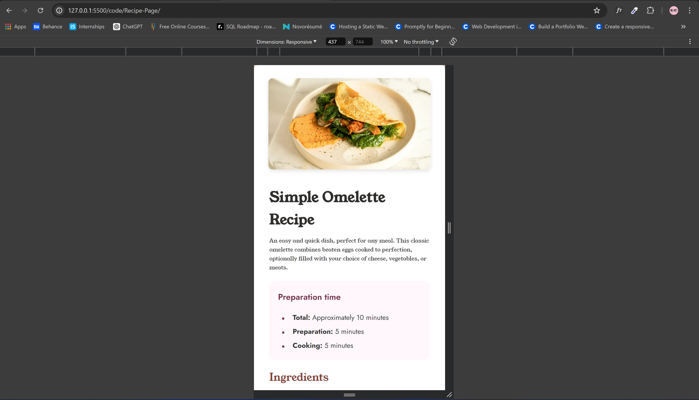

<h1>Recipe Page</h1>

<h2 id="#challenge-description">Challenge Description</h2>

 This challenge is to build out the recipe page.   This challenge is not only to build out the recipe page but also focuses on writing semantic HTML.
     Ensuring that through what HTML elements are most appropriate for each piece of content. 

<h2>Table of Content</h2>

<ol>
    <li><a href="challenge-description">Challenge Description</a></li>
    <li><a href="purpose">Purpose</a></li>
    <li><a href="features">Features</a></li>
    <li><a href="installation">Installation</a></li>
    <li><a href="preview">Preview</a></li>
    <li><a href="contributing">Contributing</a></li>
    <li><a href="credits">Credits</a></li>
    <li><a href="author">Author</a></li>
</ol>

<h2 id="#purpose">Purpose</h2>

 The purpose of this challenge is to practice building a recipe page with a focus on writing clean, semantic HTML. This project aims to help improve your HTML and CSS skills and ensure that you are using the most appropriate HTML elements for each piece of content. 

<h2 id="#features">Features</h2>

This recipe page includes the following features:
    <pre>
    - Responsive design for both desktop and mobile views
    - A clear layout with sections for ingredients and instructions.
    </pre>

<h2 id="#installation">Installation</h2>

To install and run this project locally, follow these steps:
    <pre>
    1. Clone the repository: <code> git clone https://github.com/Yashi-Singh-1/Recipe-Page.git </code>
    2. Navigate to the project directory: <code> cd recipe-page </code>
    3. Open <code> index.html </code> in your preferred web browser
    </pre>

<h2 id="#preview">Preview</h2>

The Desktop Preview

The Mobile Preview

You can live preview the challenge on my CodePen: <a href="https://codepen.io/Yashi-the-lessful/pen/pomKWLv">https://codepen.io/Yashi-the-lessful/pen/pomKWLv</a>

<h2 id="#contributing">Contributing</h2>

If you would like to contribute to this project, please follow these guidelines:
    <pre>
    1. Fork the repository
    2. Create a new branch (<code> git checkout -b feature-branch </code>)
    3. Make your changes
    4. Commit your changes (<code> git commit -m 'Add some feature' </code>)
    5. Push to the branch (<code> git push origin feature-branch </code>)
    6. Open a pull request
    </pre>

<h2 id="#credits">Credits</h2>

This challenge credits go to <a href="https://www.frontendmentor.io/challenges/recipe-page-KiTsR8QQKm">Frontend Mentor</a> for their idea.

<h2 id="#author">Author</h2>

This challnege completed by Yashi Singh on 25-06-2024. 
